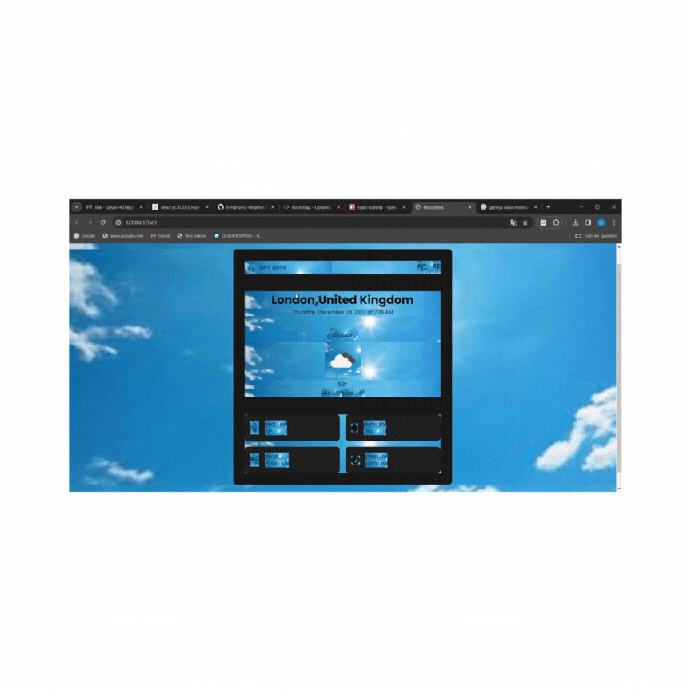

<h1>home page</h1>
🌤⛈️🌩🌨🌧☁🌥🌈☀☃️⛄💨🌪🌫🌊💧
✅WeatherApp Project✅

☀ConvertTimeStamp: Created a function that returns a formatted date and time based on the time zone.

☀ConvertCountryCode: Developed a function that translates a country code into the corresponding country name.

☀OpenWeather API: Established a function to retrieve weather information by making a request to the OpenWeather API with city, unit, and API key parameters.

☀UpdateUI: Created a function that updates the user interface using the weather data obtained from the API.

🌤⛈️🌩🌨🌧☁🌥🌈☃️⛄💨🌪🌫🌊💧💦

<h1>used technologies</h1>
📌HTML
📌CSS
📌JavaScript
📌API

# weatherApp-Pro

